# Trip Computer Architecture Diagram

## System Architecture - How It All Works Together

## Data Flow - From Session to Insights

```mermaid
graph LR
    Session["🎬 Claude Code<br/>Session"]

    Transcript["📄 Transcript<br/>JSONL"]

    Parse["Parse Tokens<br/>& Messages"]

    Store["Store in<br/>sessions.jsonl"]

    Calc["Calculate<br/>Metrics"]

    Display["Display on<br/>Status Line"]

    Command["/trip-computer<br/>Command"]

    Analyze["Claude Analyzes<br/>Patterns"]

    Dashboard["🖥️ Show<br/>Dashboard"]

    Session --> Transcript
    Transcript --> Parse
    Parse --> Store
    Store --> Calc
    Calc --> Display
    Calc --> Command
    Command --> Analyze
    Analyze --> Dashboard

    style Session fill:#bbdefb
    style Transcript fill:#e3f2fd
    style Parse fill:#f8bbd0
    style Store fill:#ffe0b2
    style Calc fill:#c8e6c9
    style Display fill:#d1c4e9
    style Command fill:#c5e1a5
    style Analyze fill:#b2dfdb
    style Dashboard fill:#ffccbc
```

## Status Line Evolution Across Phases

```mermaid
graph TB
    subgraph Phase1["Phase 1: Foundation"]
        SL1["💬 47 msgs | 🔧 12 tools<br/>💳 ~$2.35 | ⚡ 78% eff | 📊 /trip<br/><br/>(Basic metrics, no billing context)"]
    end

    subgraph Phase2["Phase 2: Subscription Excellence"]
        SL2["📅 Pro: 89K/220K (40%)<br/>⚡ 2.1K tokens/msg | 🕐 1h 15m until reset<br/>📊 /trip<br/><br/>(Quota-focused, burn rate visible)"]
    end

    subgraph Phase3["Phase 3: Claude Analyzing Claude"]
        SL3["📅 Pro: 89K (40%) | ↑+8 vs baseline<br/>⚡ 78/100 | 💾 42% cache | 📊 /trip<br/><br/>(Personalized, trended, analyzed)"]
    end

    subgraph Phase4["Phase 4: Customizable"]
        SL4A["📅 Pro: 89K/220K (40%) | 🕐 1h 15m | 📊 /trip<br/>(Subscription mode - custom choice)"]
        SL4B["💬 47 | 💳 $2.35 | ⚡ 42% cache | 📊 /trip<br/>(API mode - custom choice)"]
        SL4C["⭐ 78/100 | 📈 +8 vs baseline | 💾 42% | 📊 /trip<br/>(Performance mode - custom choice)"]
    end

    Phase1 --> Phase2
    Phase2 --> Phase3
    Phase3 --> Phase4

    style Phase1 fill:#e1f5ff,stroke:#01579b
    style Phase2 fill:#f3e5f5,stroke:#4a148c
    style Phase3 fill:#e8f5e9,stroke:#1b5e20
    style Phase4 fill:#fff3e0,stroke:#e65100
```

## Dashboard Widget Layout - /trip-computer Command

```mermaid
graph TB
    DashHeader["📊 QUICK SUMMARY<br/>Quota: 89K/220K (40%) | Time to limit: 1h 15m | Cycles: 3"]

    subgraph Windows["📅 QUOTA WINDOWS"]
        W5H["5-Hour: 89K/220K (40%)<br/>Burn: 2.1K/msg | Reset: 4h 37m"]
        W7D["7-Day: 450K/1.5M (30%)<br/>Avg: 150K/day | Days left: 4"]
    end

    subgraph Models["🤖 MODEL MIX"]
        MOpus["Opus: 30K (34%)"]
        MSonnet["Sonnet: 40K (45%)"]
        MHaiku["Haiku: 19K (21%)"]
    end

    subgraph Recs["🎯 SMART RECOMMENDATIONS"]
        R1["1. Switch Haiku for tests"]
        R2["2. Trim context by 30%"]
        R3["3. /clear at 75% threshold"]
    end

    subgraph Patterns["📚 YOUR PATTERNS"]
        Pat1["Best time: 9-12 AM (72% eff)"]
        Pat2["Haiku saves 50% quota"]
        Pat3["Research costs 3x more"]
    end

    subgraph Insights["📝 CLAUDE'S ANALYSIS"]
        Ins1["You're off to strong start"]
        Ins2["Context trimming improving"]
        Ins3["At this pace: 60 msgs remaining"]
    end

    DashHeader --> Windows
    Windows --> Models
    Models --> Recs
    Recs --> Patterns
    Patterns --> Insights

    style DashHeader fill:#b2dfdb,stroke:#00695c,stroke-width:2px
    style Windows fill:#c5e1a5,stroke:#558b2f,stroke-width:2px
    style Models fill:#fff9c4,stroke:#f57f17,stroke-width:2px
    style Recs fill:#ffccbc,stroke:#bf360c,stroke-width:2px
    style Patterns fill:#f8bbd0,stroke:#c2185b,stroke-width:2px
    style Insights fill:#d1c4e9,stroke:#512da8,stroke-width:2px
```

## Core Feature Components by Phase

## Subscription User Journey

```mermaid
graph TB
    Start["User Starts Claude Code<br/>Session"]

    Install["First Time:<br/>Auto-detect Billing"]

    Session["Session Running"]

    StatusLine["Status Line Shows<br/>📅 Pro: 40% quota<br/>🕐 1h 15m until reset"]

    Mid["Mid-Session:<br/>Hit /trip-computer"]

    Dashboard["See Dashboard<br/>- Quota windows<br/>- Recommendations<br/>- Patterns"]

    Decision{"Continue or<br/>/clear?"}

    Switch["Switch Model<br/>or Trim Context<br/>per recommendation"]

    Continue["Complete Session"]

    End["Session Ends"]

    Meta["Save Metadata<br/>- Name<br/>- Tags<br/>- Notes"]

    Store["Stored in History<br/>for learning"]

    Next["Next Session:<br/>Claude analyzes<br/>your patterns"]

    Start --> Install
    Install --> Session
    Session --> StatusLine
    StatusLine --> Mid
    Mid --> Dashboard
    Dashboard --> Decision
    Decision -->|Follow Recs| Switch
    Switch --> Continue
    Decision -->|Continue| Continue
    Continue --> End
    End --> Meta
    Meta --> Store
    Store --> Next

    style Start fill:#c8e6c9,stroke:#1b5e20,stroke-width:2px
    style Install fill:#ffccbc,stroke:#bf360c,stroke-width:2px
    style Session fill:#bbdefb,stroke:#1565c0,stroke-width:2px
    style StatusLine fill:#f8bbd0,stroke:#880e4f,stroke-width:2px
    style Mid fill:#fff9c4,stroke:#f57f17,stroke-width:2px
    style Dashboard fill:#b2dfdb,stroke:#00695c,stroke-width:2px
    style Decision fill:#d1c4e9,stroke:#512da8,stroke-width:2px
    style Switch fill:#ffccbc,stroke:#bf360c,stroke-width:2px
    style Continue fill:#c8e6c9,stroke:#1b5e20,stroke-width:2px
    style End fill:#b2dfdb,stroke:#00695c,stroke-width:2px
    style Meta fill:#fff9c4,stroke:#f57f17,stroke-width:2px
    style Store fill:#f8bbd0,stroke:#880e4f,stroke-width:2px
    style Next fill:#c5e1a5,stroke:#558b2f,stroke-width:2px
```

## How Claude Analyzes Claude - Phase 3

```mermaid
graph TB
    History["📚 Session History<br/>(23 sessions)"]

    Extract["Extract Features<br/>- Tags<br/>- Times<br/>- Models used<br/>- Efficiency"]

    Summarize["Summarize for Claude<br/>JSON with metrics"]

    Call["Call Claude API<br/>with session data"]

    Claude["Claude Analyzes<br/>→ Patterns<br/>→ Insights<br/>→ Recommendations"]

    Parse["Parse Response<br/>into sections"]

    Cache["Cache for 24h<br/>(avoid repeated calls)"]

    Display["Display in<br/>/trip-computer"]

    Examples["Show examples:<br/>- Best times<br/>- Model choices<br/>- Context size"]

    Recommend["Personalized Recs<br/>based on YOUR patterns"]

    History --> Extract
    Extract --> Summarize
    Summarize --> Call
    Call --> Claude
    Claude --> Parse
    Parse --> Cache
    Cache --> Display
    Display --> Examples
    Examples --> Recommend

    style History fill:#e8f5e9,stroke:#1b5e20,stroke-width:2px
    style Extract fill:#c5e1a5,stroke:#558b2f,stroke-width:2px
    style Summarize fill:#fff9c4,stroke:#f57f17,stroke-width:2px
    style Call fill:#ffccbc,stroke:#bf360c,stroke-width:2px
    style Claude fill:#d1c4e9,stroke:#512da8,stroke-width:2px
    style Parse fill:#f8bbd0,stroke:#880e4f,stroke-width:2px
    style Cache fill:#b2dfdb,stroke:#00695c,stroke-width:2px
    style Display fill:#bbdefb,stroke:#1565c0,stroke-width:2px
    style Examples fill:#c8e6c9,stroke:#1b5e20,stroke-width:2px
    style Recommend fill:#ffccbc,stroke:#bf360c,stroke-width:2px
```

