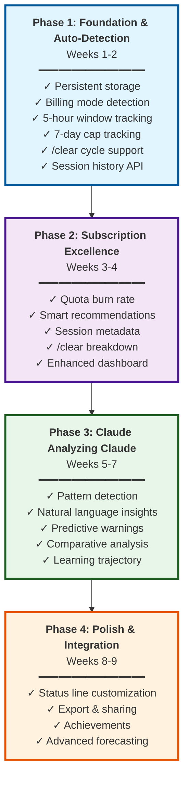
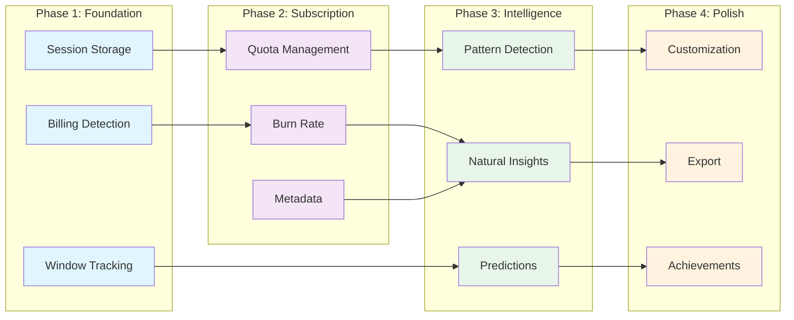
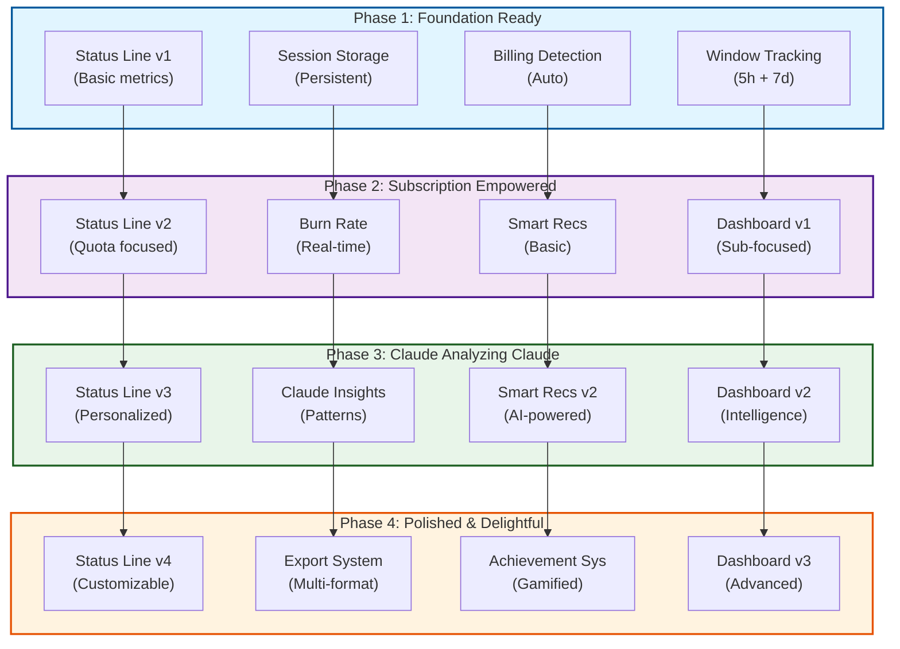
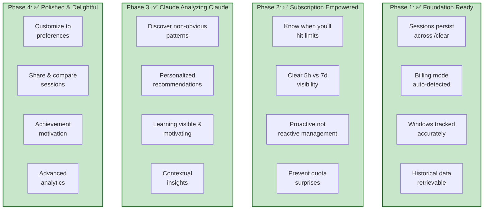

# Trip Computer Phases Diagram

## Phase Dependencies & Timeline

```mermaid
graph TD
    Phase1["<b>Phase 1: Foundation & Auto-Detection</b><br/>Weeks 1-2<br/>━━━━━━━━━━━━━━━━<br/>✓ Persistent storage<br/>✓ Billing mode detection<br/>✓ 5-hour window tracking<br/>✓ 7-day cap tracking<br/>✓ /clear cycle support<br/>✓ Session history API"]

    Phase2["<b>Phase 2: Subscription Excellence</b><br/>Weeks 3-4<br/>━━━━━━━━━━━━━━━━<br/>✓ Quota burn rate<br/>✓ Smart recommendations<br/>✓ Session metadata<br/>✓ /clear breakdown<br/>✓ Enhanced dashboard"]

    Phase3["<b>Phase 3: Claude Analyzing Claude</b><br/>Weeks 5-7<br/>━━━━━━━━━━━━━━━━<br/>✓ Pattern detection<br/>✓ Natural language insights<br/>✓ Predictive warnings<br/>✓ Comparative analysis<br/>✓ Learning trajectory"]

    Phase4["<b>Phase 4: Polish & Integration</b><br/>Weeks 8-9<br/>━━━━━━━━━━━━━━━━<br/>✓ Status line customization<br/>✓ Export & sharing<br/>✓ Achievements<br/>✓ Advanced forecasting"]

    Phase1 --> Phase2
    Phase2 --> Phase3
    Phase3 --> Phase4

    style Phase1 fill:#e1f5ff,stroke:#01579b,stroke-width:3px
    style Phase2 fill:#f3e5f5,stroke:#4a148c,stroke-width:3px
    style Phase3 fill:#e8f5e9,stroke:#1b5e20,stroke-width:3px
    style Phase4 fill:#fff3e0,stroke:#e65100,stroke-width:3px
```

## What Unlocks What

```mermaid
graph LR
    subgraph "Phase 1: Foundation"
        storage["Session Storage"]
        detect["Billing Detection"]
        windows["Window Tracking"]
    end

    subgraph "Phase 2: Subscription"
        quota["Quota Management"]
        burn["Burn Rate"]
        meta["Metadata"]
    end

    subgraph "Phase 3: Intelligence"
        patterns["Pattern Detection"]
        insights["Natural Insights"]
        predict["Predictions"]
    end

    subgraph "Phase 4: Polish"
        custom["Customization"]
        export["Export"]
        achieve["Achievements"]
    end

    storage --> quota
    detect --> burn
    windows --> predict

    quota --> patterns
    burn --> insights
    meta --> insights

    patterns --> custom
    insights --> export
    predict --> achieve

    style storage fill:#e1f5ff
    style detect fill:#e1f5ff
    style windows fill:#e1f5ff
    style quota fill:#f3e5f5
    style burn fill:#f3e5f5
    style meta fill:#f3e5f5
    style patterns fill:#e8f5e9
    style insights fill:#e8f5e9
    style predict fill:#e8f5e9
    style custom fill:#fff3e0
    style export fill:#fff3e0
    style achieve fill:#fff3e0
```

## Feature Maturity by Phase

```mermaid
graph TB
    subgraph Phase1["Phase 1: Foundation Ready"]
        F1A["Status Line v1<br/>(Basic metrics)"]
        F1B["Session Storage<br/>(Persistent)"]
        F1C["Billing Detection<br/>(Auto)"]
        F1D["Window Tracking<br/>(5h + 7d)"]
    end

    subgraph Phase2["Phase 2: Subscription Empowered"]
        F2A["Status Line v2<br/>(Quota focused)"]
        F2B["Burn Rate<br/>(Real-time)"]
        F2C["Smart Recs<br/>(Basic)"]
        F2D["Dashboard v1<br/>(Sub-focused)"]
    end

    subgraph Phase3["Phase 3: Claude Analyzing Claude"]
        F3A["Status Line v3<br/>(Personalized)"]
        F3B["Claude Insights<br/>(Patterns)"]
        F3C["Smart Recs v2<br/>(AI-powered)"]
        F3D["Dashboard v2<br/>(Intelligence)"]
    end

    subgraph Phase4["Phase 4: Polished & Delightful"]
        F4A["Status Line v4<br/>(Customizable)"]
        F4B["Export System<br/>(Multi-format)"]
        F4C["Achievement Sys<br/>(Gamified)"]
        F4D["Dashboard v3<br/>(Advanced)"]
    end

    F1A --> F2A --> F3A --> F4A
    F1B --> F2B --> F3B --> F4B
    F1C --> F2C --> F3C --> F4C
    F1D --> F2D --> F3D --> F4D

    style Phase1 fill:#e1f5ff,stroke:#01579b,stroke-width:2px
    style Phase2 fill:#f3e5f5,stroke:#4a148c,stroke-width:2px
    style Phase3 fill:#e8f5e9,stroke:#1b5e20,stroke-width:2px
    style Phase4 fill:#fff3e0,stroke:#e65100,stroke-width:2px
```

## Success Criteria per Phase

```mermaid
graph TB
    subgraph P1["Phase 1: ✅ Foundation Ready"]
        P1_1["Sessions persist<br/>across /clear"]
        P1_2["Billing mode<br/>auto-detected"]
        P1_3["Windows tracked<br/>accurately"]
        P1_4["Historical data<br/>retrievable"]
    end

    subgraph P2["Phase 2: ✅ Subscription Empowered"]
        P2_1["Know when you'll<br/>hit limits"]
        P2_2["Clear 5h vs 7d<br/>visibility"]
        P2_3["Proactive not<br/>reactive management"]
        P2_4["Prevent quota<br/>surprises"]
    end

    subgraph P3["Phase 3: ✅ Claude Analyzing Claude"]
        P3_1["Discover non-obvious<br/>patterns"]
        P3_2["Personalized<br/>recommendations"]
        P3_3["Learning visible &<br/>motivating"]
        P3_4["Contextual<br/>insights"]
    end

    subgraph P4["Phase 4: ✅ Polished & Delightful"]
        P4_1["Customize to<br/>preferences"]
        P4_2["Share & compare<br/>sessions"]
        P4_3["Achievement<br/>motivation"]
        P4_4["Advanced<br/>analytics"]
    end

    style P1 fill:#c8e6c9,stroke:#1b5e20,stroke-width:2px
    style P2 fill:#c8e6c9,stroke:#1b5e20,stroke-width:2px
    style P3 fill:#c8e6c9,stroke:#1b5e20,stroke-width:2px
    style P4 fill:#c8e6c9,stroke:#1b5e20,stroke-width:2px
```
